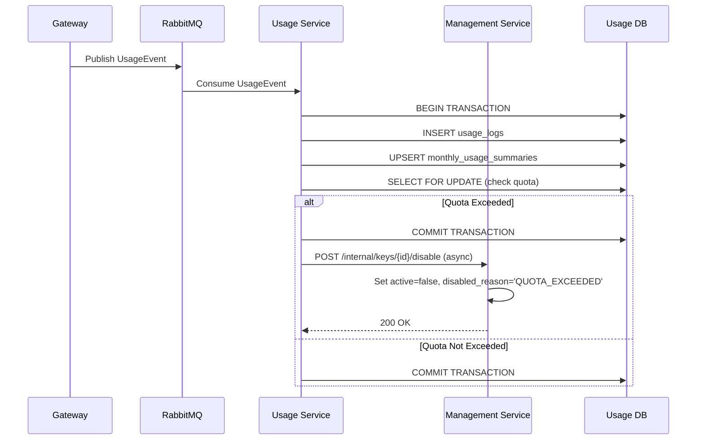
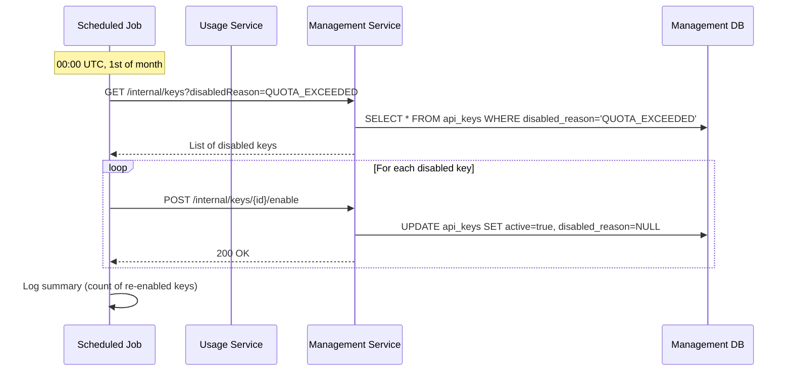

# Design Document: Quota Enforcement & Auto-Disable

## Overview

The Quota Enforcement feature implements automatic monitoring and enforcement of monthly API usage quotas. When an API key reaches 100% of its allocated monthly quota, the system automatically disables the key to prevent over-usage. This design builds on the existing usage tracking infrastructure (Sprint 10) and integrates with the API key management system through inter-service communication.

### Key Design Goals

1. **Real-time Enforcement**: Quota checks occur immediately after each usage event is processed
2. **Atomicity**: Quota checking and usage updates happen within the same database transaction
3. **Non-blocking**: Deactivation calls to Management Service do not block usage event processing
4. **Idempotency**: All operations handle retries and duplicate calls gracefully
5. **Observability**: Comprehensive logging for audit trails and troubleshooting
6. **Performance**: Minimal overhead on the existing usage tracking pipeline

### Scope

**In Scope:**
- Quota checking logic in Usage Service after each usage event
- REST client for inter-service communication (Usage → Management)
- Internal API endpoint in Management Service for key deactivation
- Gateway integration to reject requests from disabled keys
- Monthly reset mechanism via scheduled job
- Race condition handling with database locking
- Configuration flags for enabling/disabling quota enforcement

**Out of Scope:**
- Webhook notifications (Sprint 12)
- Usage analytics dashboard
- Quota adjustment APIs
- Billing integration

## Architecture

### System Context

```mermaid
graph TB
    Gateway[Gateway Service]
    Usage[Usage Service]
    Management[Management Service]
    RabbitMQ[(RabbitMQ)]
    UsageDB[(Usage DB)]
    ManagementDB[(Management DB)]
    Redis[(Redis Cache)]
    
    Gateway -->|Publish UsageEvent| RabbitMQ
    RabbitMQ -->|Consume UsageEvent| Usage
    Usage -->|Read/Write| UsageDB
    Usage -->|POST /internal/keys/{id}/disable| Management
    Management -->|Read/Write| ManagementDB
    Gateway -->|Validate Key| Management
    Gateway -->|Cache Config| Redis
    Management -->|Invalidate Cache| Redis
    
    style Usage fill:#e1f5ff
    style Management fill:#fff4e1
```

### Component Interaction Flow

**Quota Enforcement Flow:**



**Monthly Reset Flow:**



## Components and Interfaces

### 1. QuotaEnforcementService (Usage Service)

**Responsibility:** Check quota limits after usage updates and trigger key deactivation when limits are exceeded.

**Key Methods:**

```java
public interface QuotaEnforcementService {
    /**
     * Check if the API key has exceeded its monthly quota and trigger deactivation if needed.
     * This method is called after each usage event is processed.
     * 
     * @param apiKeyId The UUID of the API key
     * @param yearMonth The year-month period (format: YYYY-MM)
     * @param currentUsage The current total request count
     */
    void checkAndEnforceQuota(String apiKeyId, String yearMonth, long currentUsage);
    
    /**
     * Retrieve the monthly quota for an API key from the Management Service.
     * Returns -1 for unlimited quotas.
     * 
     * @param apiKeyId The UUID of the API key
     * @return The monthly quota limit, or -1 for unlimited
     */
    long getMonthlyQuota(String apiKeyId);
}
```

**Configuration Properties:**

```yaml
quota:
  enforcement:
    enabled: true  # Feature flag
    management-service-url: http://localhost:8081
    timeout-ms: 5000
    connection-pool-size: 10
```

### 2. ManagementServiceClient (Usage Service)

**Responsibility:** REST client for communicating with Management Service internal APIs.

**Key Methods:**

```java
public interface ManagementServiceClient {
    /**
     * Call Management Service to disable an API key.
     * This call is non-blocking and failures are logged but do not throw exceptions.
     * 
     * @param apiKeyId The UUID of the API key to disable
     * @return CompletableFuture that completes when the call finishes
     */
    CompletableFuture<Void> disableKey(String apiKeyId);
    
    /**
     * Retrieve API key details including plan and quota information.
     * 
     * @param apiKeyId The UUID of the API key
     * @return ApiKeyDetailsDTO containing plan and quota info
     */
    ApiKeyDetailsDTO getApiKeyDetails(String apiKeyId);
    
    /**
     * Call Management Service to re-enable an API key.
     * Used by the monthly reset job.
     * 
     * @param apiKeyId The UUID of the API key to enable
     * @return CompletableFuture that completes when the call finishes
     */
    CompletableFuture<Void> enableKey(String apiKeyId);
    
    /**
     * Retrieve all API keys disabled due to quota exceeded.
     * Used by the monthly reset job.
     * 
     * @return List of API key IDs
     */
    List<String> getQuotaDisabledKeys();
}
```

**Implementation Notes:**
- Use Spring's `WebClient` for reactive, non-blocking HTTP calls
- Configure connection pooling and timeouts
- Implement circuit breaker pattern for resilience (optional enhancement)
- Log all failures but do not propagate exceptions to caller

### 3. InternalKeyManagementController (Management Service)

**Responsibility:** Provide internal APIs for key lifecycle management (disable, enable, query).

**Endpoints:**

```java
@RestController
@RequestMapping("/internal/keys")
public class InternalKeyManagementController {
    
    /**
     * Disable an API key with a specific reason.
     * Idempotent: returns 200 even if key is already disabled.
     * 
     * POST /internal/keys/{keyId}/disable
     * Request Body: { "reason": "QUOTA_EXCEEDED" }
     * Response: 200 OK { "message": "Key disabled", "wasAlreadyDisabled": false }
     */
    @PostMapping("/{keyId}/disable")
    ResponseEntity<DisableKeyResponse> disableKey(
        @PathVariable UUID keyId, 
        @RequestBody DisableKeyRequest request
    );
    
    /**
     * Enable an API key (clear disabled status).
     * Idempotent: returns 200 even if key is already enabled.
     * 
     * POST /internal/keys/{keyId}/enable
     * Response: 200 OK { "message": "Key enabled", "wasAlreadyEnabled": false }
     */
    @PostMapping("/{keyId}/enable")
    ResponseEntity<EnableKeyResponse> enableKey(@PathVariable UUID keyId);
    
    /**
     * Query API keys by disabled reason.
     * 
     * GET /internal/keys?disabledReason=QUOTA_EXCEEDED
     * Response: 200 OK [ "uuid1", "uuid2", ... ]
     */
    @GetMapping
    ResponseEntity<List<String>> getKeysByDisabledReason(
        @RequestParam(required = false) String disabledReason
    );
}
```

**DTOs:**

```java
public record DisableKeyRequest(String reason) {}

public record DisableKeyResponse(
    String message, 
    boolean wasAlreadyDisabled
) {}

public record EnableKeyResponse(
    String message, 
    boolean wasAlreadyEnabled
) {}

public record ApiKeyDetailsDTO(
    String apiKeyId,
    String planName,
    long monthlyQuota,
    int rateLimitRpm,
    boolean active,
    String disabledReason
) {}
```

### 4. MonthlyResetScheduler (Usage Service)

**Responsibility:** Scheduled job that runs on the first day of each month to re-enable quota-disabled keys.

**Key Methods:**

```java
@Component
public class MonthlyResetScheduler {
    
    /**
     * Scheduled job that runs at 00:00 UTC on the 1st of each month.
     * Queries all keys disabled due to QUOTA_EXCEEDED and re-enables them.
     */
    @Scheduled(cron = "0 0 0 1 * ?", zone = "UTC")
    public void resetMonthlyQuotas();
}
```

**Implementation Notes:**
- Use Spring's `@Scheduled` annotation with cron expression
- Query Management Service for all keys with `disabledReason = "QUOTA_EXCEEDED"`
- Call `enableKey()` for each disabled key
- Log summary statistics (total keys re-enabled, any failures)
- Handle partial failures gracefully (continue processing remaining keys)

### 5. Enhanced UsageService (Usage Service)

**Modifications to Existing Service:**

```java
@Service
@RequiredArgsConstructor
@Slf4j
public class UsageService {
    
    private final UsageLogRepository logRepository;
    private final MonthlyUsageSummaryRepository summaryRepository;
    private final QuotaEnforcementService quotaEnforcementService;
    private final QuotaEnforcementConfig config;
    
    @Transactional(isolation = Isolation.READ_COMMITTED)
    public void processUsageEvent(UsageEvent event) {
        // Existing logic: persist log and update summary
        // ...
        
        // NEW: Check quota after updating summary
        if (config.isEnabled()) {
            MonthlyUsageSummary summary = summaryRepository
                .findByApiKeyIdAndYearMonth(event.apiKeyId(), yearMonth)
                .orElseThrow();
            
            quotaEnforcementService.checkAndEnforceQuota(
                event.apiKeyId(), 
                yearMonth, 
                summary.getTotalRequests()
            );
        }
    }
}
```

### 6. Enhanced ApiKeyAuthFilter (Gateway Service)

**Modifications to Existing Filter:**

```java
@Override
public Mono<Void> filter(ServerWebExchange exchange, GatewayFilterChain chain) {
    // ... existing key validation logic ...
    
    .flatMap(config -> {
        if (!config.active()) {
            // NEW: Include disabled reason in error response
            String reason = config.disabledReason() != null 
                ? config.disabledReason() 
                : "Unknown";
            log.warn("Request rejected — API key is disabled. Reason: {}", reason);
            return reject(exchange, HttpStatus.FORBIDDEN, 
                "API key is disabled. Reason: " + reason);
        }
        
        // ... continue with request ...
    });
}
```

**Cache Invalidation:**

When a key is disabled, the Management Service should invalidate the Redis cache entry to ensure the Gateway immediately rejects requests:

```java
@Service
public class ApiKeyService {
    
    private final RedisTemplate<String, ApiConfigDTO> redisTemplate;
    
    public void disableKey(UUID keyId, String reason) {
        // Update database
        // ...
        
        // Invalidate cache
        String cacheKey = "api:config:" + keyHash;
        redisTemplate.delete(cacheKey);
    }
}
```

## Data Models

### Database Schema Changes

**api_keys table (Management DB):**

No schema changes required. The existing `disabled_reason` column will be populated with `"QUOTA_EXCEEDED"` when quota enforcement triggers.

```sql
-- Existing schema (no changes)
CREATE TABLE api_keys (
    id UUID PRIMARY KEY,
    key_hash VARCHAR(64) NOT NULL UNIQUE,
    key_prefix VARCHAR(8) NOT NULL,
    registered_api_id UUID NOT NULL,
    plan_id UUID NOT NULL,
    active BOOLEAN NOT NULL DEFAULT true,
    disabled_reason VARCHAR(255),  -- Will store "QUOTA_EXCEEDED"
    created_at TIMESTAMP NOT NULL,
    FOREIGN KEY (registered_api_id) REFERENCES registered_apis(id),
    FOREIGN KEY (plan_id) REFERENCES plans(id)
);
```

**monthly_usage_summaries table (Usage DB):**

No schema changes required. The existing table structure supports quota enforcement.

```sql
-- Existing schema (no changes)
CREATE TABLE monthly_usage_summaries (
    id BIGSERIAL PRIMARY KEY,
    api_key_id VARCHAR(36) NOT NULL,
    year_month VARCHAR(7) NOT NULL,  -- Format: YYYY-MM
    total_requests BIGINT NOT NULL DEFAULT 0,
    successful_requests BIGINT NOT NULL DEFAULT 0,
    UNIQUE(api_key_id, year_month)
);
```

### Query for Quota Checking with Locking

To prevent race conditions, the quota check query uses `SELECT FOR UPDATE`:

```sql
-- Query to check quota with row-level locking
SELECT 
    mus.total_requests,
    p.monthly_quota
FROM monthly_usage_summaries mus
JOIN api_keys ak ON ak.id::text = mus.api_key_id
JOIN plans p ON p.id = ak.plan_id
WHERE mus.api_key_id = :apiKeyId 
  AND mus.year_month = :yearMonth
FOR UPDATE OF mus;
```

This ensures that concurrent usage events for the same API key are serialized during quota checking.

### Index Requirements

**Existing indexes are sufficient:**

```sql
-- monthly_usage_summaries
CREATE UNIQUE INDEX idx_monthly_usage_key_month 
    ON monthly_usage_summaries(api_key_id, year_month);

-- api_keys
CREATE INDEX idx_api_keys_disabled_reason 
    ON api_keys(disabled_reason) 
    WHERE disabled_reason IS NOT NULL;
```

The second index supports efficient queries for the monthly reset job.

## Error Handling

### Error Scenarios and Responses

| Scenario | Component | Handling Strategy |
|----------|-----------|-------------------|
| Management Service unavailable during disable call | Usage Service | Log error, continue processing. Key will be disabled on next usage event. |
| Network timeout during disable call | Usage Service | Log error with timeout details. Retry on next usage event. |
| API key not found during disable | Management Service | Return 404, log warning. Usage Service logs error. |
| Database deadlock during quota check | Usage Service | Transaction rolls back, RabbitMQ redelivers event. |
| Concurrent disable requests for same key | Management Service | Idempotent operation, both return 200 OK. |
| Monthly reset job fails mid-execution | Usage Service | Log partial success, continue with remaining keys. |
| Invalid yearMonth format | Usage Service | Log error, skip quota check for that event. |
| Negative or zero quota value | Usage Service | Treat as unlimited (skip enforcement). |

### Logging Strategy

**Usage Service:**

```java
// INFO: Normal quota enforcement
log.info("Quota exceeded for key: {}, usage: {}/{}, triggering deactivation", 
    apiKeyId, currentUsage, quota);

// INFO: Successful deactivation
log.info("API key disabled successfully: keyId={}, reason=QUOTA_EXCEEDED", apiKeyId);

// ERROR: Deactivation call failed
log.error("Failed to disable API key: keyId={}, error={}", apiKeyId, e.getMessage(), e);

// DEBUG: Quota check passed
log.debug("Quota check passed for key: {}, usage: {}/{}", apiKeyId, currentUsage, quota);
```

**Management Service:**

```java
// INFO: Key deactivation
log.info("API key deactivated: keyId={}, reason={}, timestamp={}", 
    keyId, reason, Instant.now());

// WARN: Idempotent operation
log.warn("Disable request for already-disabled key: keyId={}, existingReason={}", 
    keyId, existingReason);
```

**Gateway Service:**

```java
// WARN: Rejected request from disabled key
log.warn("Request rejected — disabled key: keyHash={}, reason={}, path={}", 
    keyHash, disabledReason, path);
```

### Correlation IDs

All log messages should include a correlation ID to trace quota enforcement actions across services:

```java
MDC.put("correlationId", event.eventId());
log.info("Processing usage event: apiKeyId={}", event.apiKeyId());
MDC.clear();
```

## Testing Strategy

### Unit Tests

**Focus Areas:**
- Quota calculation logic (boundary conditions: exactly at quota, one over quota)
- Idempotent disable/enable operations
- Configuration flag behavior (enabled/disabled)
- Error handling for REST client failures
- YearMonth formatting and parsing

**Example Unit Tests:**

```java
@Test
void shouldTriggerDeactivationWhenQuotaExactlyReached() {
    // Given: usage = 1000, quota = 1000
    // When: checkAndEnforceQuota() is called
    // Then: disableKey() should be invoked
}

@Test
void shouldSkipEnforcementForUnlimitedQuota() {
    // Given: quota = -1 (unlimited)
    // When: checkAndEnforceQuota() is called
    // Then: disableKey() should NOT be invoked
}

@Test
void shouldHandleManagementServiceUnavailable() {
    // Given: Management Service returns 503
    // When: disableKey() is called
    // Then: exception is logged, no exception thrown
}
```

### Integration Tests

**Focus Areas:**
- End-to-end flow: usage event → quota check → key deactivation
- Gateway rejection of disabled keys
- Monthly reset job execution
- Database transaction isolation and locking
- Redis cache invalidation

**Example Integration Tests:**

```java
@SpringBootTest
@Testcontainers
class QuotaEnforcementIntegrationTest {
    
    @Test
    void shouldDisableKeyWhenQuotaExceeded() {
        // Given: API key with quota = 100
        // When: 100 usage events are published
        // Then: key should be disabled with reason "QUOTA_EXCEEDED"
        // And: Gateway should reject subsequent requests with 403
    }
    
    @Test
    void shouldReEnableKeysOnMonthlyReset() {
        // Given: API key disabled due to QUOTA_EXCEEDED
        // When: Monthly reset job runs
        // Then: key should be re-enabled (active = true, disabled_reason = null)
    }
}
```

### Property-Based Tests

Property-based testing is **NOT applicable** for this feature because:

1. **Infrastructure Integration**: The feature primarily involves inter-service communication, database transactions, and scheduled jobs — not pure functions with universal properties.

2. **External Dependencies**: Quota enforcement depends on REST API calls, database state, and message queue behavior, which are not suitable for property-based testing.

3. **State-Dependent Behavior**: The system's behavior depends on external state (current usage, quota limits, key status) rather than input transformations.

**Alternative Testing Approach:**

Instead of property-based tests, we will use:
- **Integration tests** with Testcontainers to verify the full flow
- **Mock-based unit tests** for service layer logic
- **Contract tests** to verify REST API behavior between services

### Performance Tests

**Quota Check Performance:**

```java
@Test
void quotaCheckShouldCompleteWithin50ms() {
    // Measure time for quota check operation
    // Assert: 95th percentile < 50ms
}
```

**Concurrent Request Handling:**

```java
@Test
void shouldHandleConcurrentUsageEventsForSameKey() {
    // Given: 10 concurrent usage events for same API key at quota limit
    // When: All events are processed
    // Then: Only one disable call should be made
    // And: All events should be persisted correctly
}
```

## Implementation Notes

### Transaction Isolation

Use `READ_COMMITTED` isolation level for the usage processing transaction:

```java
@Transactional(isolation = Isolation.READ_COMMITTED)
public void processUsageEvent(UsageEvent event) {
    // ...
}
```

This prevents dirty reads while allowing concurrent processing of events for different keys.

### Async Deactivation Call

The deactivation call to Management Service should be non-blocking:

```java
@Async
public CompletableFuture<Void> disableKey(String apiKeyId) {
    try {
        webClient.post()
            .uri("/internal/keys/{keyId}/disable", apiKeyId)
            .bodyValue(new DisableKeyRequest("QUOTA_EXCEEDED"))
            .retrieve()
            .toBodilessEntity()
            .block(Duration.ofSeconds(5));
        return CompletableFuture.completedFuture(null);
    } catch (Exception e) {
        log.error("Failed to disable key: {}", apiKeyId, e);
        return CompletableFuture.failedFuture(e);
    }
}
```

However, the transaction should commit **before** making the async call to avoid holding database locks during network I/O.

### Configuration Management

Externalize all configuration to `application.yaml`:

```yaml
quota:
  enforcement:
    enabled: ${QUOTA_ENFORCEMENT_ENABLED:true}
    management-service-url: ${MANAGEMENT_SERVICE_URL:http://localhost:8081}
    timeout-ms: ${QUOTA_ENFORCEMENT_TIMEOUT:5000}
    connection-pool-size: ${QUOTA_ENFORCEMENT_POOL_SIZE:10}

management-service:
  base-url: ${MANAGEMENT_SERVICE_URL:http://localhost:8081}
```

### Monitoring and Metrics

Expose Prometheus metrics for observability:

```java
@Component
public class QuotaEnforcementMetrics {
    
    private final Counter quotaExceededCounter;
    private final Counter deactivationSuccessCounter;
    private final Counter deactivationFailureCounter;
    private final Timer quotaCheckTimer;
    
    // Increment counters in service methods
}
```

**Key Metrics:**
- `quota_exceeded_total`: Count of keys that exceeded quota
- `key_deactivation_success_total`: Count of successful deactivations
- `key_deactivation_failure_total`: Count of failed deactivations
- `quota_check_duration_seconds`: Histogram of quota check latency
- `monthly_reset_keys_enabled_total`: Count of keys re-enabled by monthly job

---

## Summary

This design implements quota enforcement through a combination of:

1. **Real-time checking** in the Usage Service after each usage event
2. **Inter-service communication** via REST APIs for key lifecycle management
3. **Database locking** to prevent race conditions
4. **Async, non-blocking** deactivation calls to maintain performance
5. **Scheduled jobs** for monthly quota resets
6. **Comprehensive logging** for audit trails and troubleshooting

The design prioritizes **atomicity**, **idempotency**, and **observability** while maintaining the performance characteristics of the existing usage tracking system.
