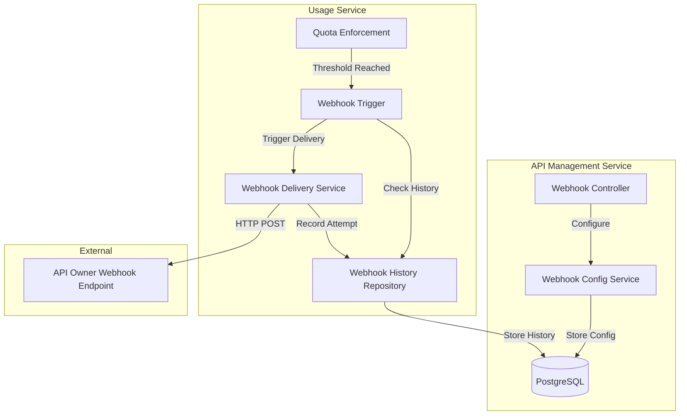

# Design Document: Webhook Notifications

## Overview

The Webhook Notification System provides real-time notifications to API owners when their customers approach or exceed monthly quota limits. This system integrates with the existing quota enforcement mechanism (Sprint 11) and extends it with configurable webhook endpoints, secure payload delivery with HMAC signatures, automatic retry logic with exponential backoff, and comprehensive delivery tracking.

### Key Capabilities

- **Configurable Webhooks**: API owners can configure HTTPS webhook URLs for their API keys
- **Threshold-Based Notifications**: Automatic notifications at 80% (warning) and 100% (exceeded) quota thresholds
- **Secure Delivery**: HMAC-SHA256 signatures for webhook payload verification
- **Reliable Delivery**: Automatic retry with exponential backoff (up to 3 attempts)
- **Delivery Tracking**: Complete history of all webhook delivery attempts with status and error details
- **Deduplication**: Prevents duplicate notifications for the same threshold within a billing period

### Integration Points

- **API Management Service**: Webhook configuration and management endpoints
- **Usage Service**: Quota threshold detection and webhook triggering
- **Database**: Webhook configuration storage and delivery history tracking

## Architecture

### Component Overview



### Data Flow

1. **Configuration Phase**:
   - API owner configures webhook URL via API Management Service
   - Webhook URL and shared secret stored in database
   - URL validation ensures HTTPS protocol and valid format

2. **Detection Phase**:
   - Usage Service monitors quota consumption
   - When threshold (80% or 100%) is reached, webhook trigger is activated
   - System checks webhook history to prevent duplicate notifications

3. **Delivery Phase**:
   - Webhook payload is constructed with usage details
   - HMAC signature is generated using shared secret
   - HTTP POST request is sent to configured webhook URL
   - Retry logic handles transient failures with exponential backoff

4. **Tracking Phase**:
   - Each delivery attempt is recorded in webhook history
   - Status, response code, retry count, and errors are tracked
   - History is available via API for troubleshooting

## Components and Interfaces

### 1. Webhook Configuration Storage

**Database Schema Extensions**:

```sql
-- Add webhook configuration to api_keys table
ALTER TABLE api_keys ADD COLUMN webhook_url VARCHAR(2048);
ALTER TABLE api_keys ADD COLUMN webhook_secret VARCHAR(64);

-- Create webhook history table
CREATE TABLE webhook_history (
    id UUID PRIMARY KEY DEFAULT gen_random_uuid(),
    api_key_id UUID NOT NULL REFERENCES api_keys(id),
    event_type VARCHAR(50) NOT NULL,
    threshold_percentage INT NOT NULL,
    year_month VARCHAR(7) NOT NULL,
    usage_count BIGINT NOT NULL,
    quota_limit BIGINT NOT NULL,
    usage_percentage DECIMAL(5,2) NOT NULL,
    webhook_url VARCHAR(2048) NOT NULL,
    sent_at TIMESTAMP NOT NULL,
    http_status_code INT,
    retry_count INT NOT NULL DEFAULT 0,
    delivery_status VARCHAR(20) NOT NULL,
    error_message TEXT,
    created_at TIMESTAMP NOT NULL DEFAULT CURRENT_TIMESTAMP,
    UNIQUE(api_key_id, event_type, year_month)
);

CREATE INDEX idx_webhook_history_api_key ON webhook_history(api_key_id);
CREATE INDEX idx_webhook_history_sent_at ON webhook_history(sent_at DESC);
```

### 2. Webhook Configuration Service

**Location**: `api-management-service/src/main/java/com/apiguard/management/service/WebhookConfigService.java`

**Responsibilities**:
- Validate webhook URLs (HTTPS protocol, valid format)
- Store and retrieve webhook configuration
- Generate and manage shared secrets
- Enforce owner-based access control

**Key Methods**:
```java
public void configureWebhook(UUID apiKeyId, String webhookUrl, String ownerEmail)
public String getWebhookSecret(UUID apiKeyId, String ownerEmail)
public void updateWebhook(UUID apiKeyId, String webhookUrl, String ownerEmail)
public WebhookConfig getWebhookConfig(UUID apiKeyId)
```

**Validation Rules**:
- Webhook URL must use HTTPS protocol (reject http://, ftp://, etc.)
- URL must be valid HTTP URL format
- Null/empty URLs are allowed (disables webhooks)
- In production, consider blocking localhost and private IP ranges

### 3. Webhook Payload Model

**Location**: `common/src/main/java/com/apiguard/common/dto/WebhookPayload.java`

**Structure**:
```java
public record WebhookPayload(
    String eventType,        // "quota.warning", "quota.exceeded", "quota.test"
    String apiKeyId,
    long currentUsage,
    long quotaLimit,
    double usagePercentage,
    String timestamp,        // ISO 8601 format
    String yearMonth         // YYYY-MM format
) {
    public String toJson() { /* Jackson serialization */ }
    public static WebhookPayload fromJson(String json) { /* Jackson deserialization */ }
}
```

**Event Types**:
- `quota.warning`: Triggered at 80% threshold
- `quota.exceeded`: Triggered at 100% threshold
- `quota.test`: Manually triggered test notification

### 4. Webhook Delivery Service

**Location**: `usage-service/src/main/java/com/apiguard/usage/service/WebhookDeliveryService.java`

**Responsibilities**:
- Construct webhook payloads
- Generate HMAC signatures
- Send HTTP POST requests with proper headers
- Implement retry logic with exponential backoff
- Record delivery attempts in history

**Key Methods**:
```java
public void deliverWebhook(WebhookNotification notification)
private String generateHmacSignature(String timestamp, String payload, String secret)
private DeliveryResult sendWithRetry(String url, String payload, Map<String, String> headers)
private void recordDeliveryAttempt(WebhookNotification notification, DeliveryResult result)
```

**HTTP Configuration**:
- Method: POST
- Content-Type: application/json
- Timeout: 10 seconds
- Custom Headers:
  - `X-Webhook-Signature`: HMAC-SHA256 signature
  - `X-Webhook-Timestamp`: Unix timestamp in milliseconds

**Retry Configuration**:
- Maximum attempts: 3 retries (4 total attempts)
- Backoff delays: 1s, 2s, 4s (exponential)
- Success criteria: HTTP status 200-299
- Failure: Any other status or timeout/connection error

### 5. HMAC Signature Generation

**Algorithm**: HMAC-SHA256

**Signature Input**:
```
signature = HMAC-SHA256(secret, timestamp + payload)
```

**Example**:
```java
String timestamp = String.valueOf(System.currentTimeMillis());
String payload = webhookPayload.toJson();
String signatureInput = timestamp + payload;

Mac hmac = Mac.getInstance("HmacSHA256");
SecretKeySpec secretKey = new SecretKeySpec(secret.getBytes(UTF_8), "HmacSHA256");
hmac.init(secretKey);
byte[] signatureBytes = hmac.doFinal(signatureInput.getBytes(UTF_8));
String signature = Hex.encodeHexString(signatureBytes);
```

**Verification** (for API owners receiving webhooks):
```java
public boolean verifySignature(String receivedSignature, String timestamp, 
                               String payload, String secret) {
    String expectedSignature = generateHmacSignature(timestamp, payload, secret);
    return MessageDigest.isEqual(
        receivedSignature.getBytes(UTF_8),
        expectedSignature.getBytes(UTF_8)
    );
}
```

### 6. Webhook Trigger Service

**Location**: `usage-service/src/main/java/com/apiguard/usage/service/WebhookTriggerService.java`

**Responsibilities**:
- Monitor quota thresholds (80%, 100%)
- Check webhook history for deduplication
- Trigger webhook delivery when thresholds are reached
- Calculate usage percentages

**Integration Point**:
```java
// Called from quota enforcement logic
public void checkAndTriggerWebhook(String apiKeyId, long currentUsage, 
                                   long quotaLimit, String yearMonth) {
    double usagePercentage = (double) currentUsage / quotaLimit * 100;
    
    if (usagePercentage >= 100 && !hasNotificationBeenSent(apiKeyId, "quota.exceeded", yearMonth)) {
        triggerWebhook(apiKeyId, "quota.exceeded", currentUsage, quotaLimit, yearMonth);
    } else if (usagePercentage >= 80 && !hasNotificationBeenSent(apiKeyId, "quota.warning", yearMonth)) {
        triggerWebhook(apiKeyId, "quota.warning", currentUsage, quotaLimit, yearMonth);
    }
}
```

### 7. Webhook Management API

**Location**: `api-management-service/src/main/java/com/apiguard/management/controller/WebhookController.java`

**Endpoints**:

```java
// Configure webhook URL
POST /api/keys/{keyId}/webhook
{
    "webhookUrl": "https://example.com/webhooks/quota"
}

// Update webhook URL
PUT /api/keys/{keyId}/webhook
{
    "webhookUrl": "https://example.com/webhooks/quota-v2"
}

// Get webhook configuration (includes secret)
GET /api/keys/{keyId}/webhook
Response: {
    "webhookUrl": "https://example.com/webhooks/quota",
    "webhookSecret": "abc123...",
    "enabled": true
}

// Get webhook delivery history
GET /api/keys/{keyId}/webhook/history?limit=50
Response: [
    {
        "id": "uuid",
        "eventType": "quota.warning",
        "sentAt": "2024-01-15T10:30:00Z",
        "httpStatusCode": 200,
        "retryCount": 0,
        "deliveryStatus": "SUCCESS",
        "usagePercentage": 82.5
    }
]

// Trigger test webhook
POST /api/keys/{keyId}/webhook/test
Response: {
    "message": "Test webhook sent",
    "deliveryStatus": "SUCCESS"
}
```

**Authorization**:
- All endpoints require JWT authentication
- API key owner validation: `apiKey.registeredApi.owner.email == authenticatedUser.email`

### 8. Webhook History Repository

**Location**: `usage-service/src/main/java/com/apiguard/usage/repository/WebhookHistoryRepository.java`

**Key Queries**:
```java
// Check if notification already sent
boolean existsByApiKeyIdAndEventTypeAndYearMonth(UUID apiKeyId, String eventType, String yearMonth);

// Get history for API key
List<WebhookHistory> findByApiKeyIdOrderBySentAtDesc(UUID apiKeyId, Pageable pageable);

// Get recent failures for monitoring
List<WebhookHistory> findByDeliveryStatusAndSentAtAfter(String status, Instant after);
```

## Data Models

### WebhookPayload (DTO)

```java
public record WebhookPayload(
    String eventType,
    String apiKeyId,
    long currentUsage,
    long quotaLimit,
    double usagePercentage,
    String timestamp,
    String yearMonth
) {
    public String toJson() throws JsonProcessingException {
        return new ObjectMapper().writeValueAsString(this);
    }
    
    public static WebhookPayload fromJson(String json) throws JsonProcessingException {
        return new ObjectMapper().readValue(json, WebhookPayload.class);
    }
}
```

### WebhookHistory (Entity)

```java
@Entity
@Table(name = "webhook_history")
public class WebhookHistory {
    @Id
    @GeneratedValue(strategy = GenerationType.UUID)
    private UUID id;
    
    @Column(name = "api_key_id", nullable = false)
    private UUID apiKeyId;
    
    @Column(name = "event_type", nullable = false)
    private String eventType;
    
    @Column(name = "threshold_percentage", nullable = false)
    private int thresholdPercentage;
    
    @Column(name = "year_month", nullable = false)
    private String yearMonth;
    
    @Column(name = "usage_count", nullable = false)
    private long usageCount;
    
    @Column(name = "quota_limit", nullable = false)
    private long quotaLimit;
    
    @Column(name = "usage_percentage", nullable = false)
    private double usagePercentage;
    
    @Column(name = "webhook_url", nullable = false)
    private String webhookUrl;
    
    @Column(name = "sent_at", nullable = false)
    private Instant sentAt;
    
    @Column(name = "http_status_code")
    private Integer httpStatusCode;
    
    @Column(name = "retry_count", nullable = false)
    private int retryCount;
    
    @Column(name = "delivery_status", nullable = false)
    private String deliveryStatus; // SUCCESS, FAILED
    
    @Column(name = "error_message", columnDefinition = "TEXT")
    private String errorMessage;
    
    @CreatedDate
    @Column(name = "created_at", nullable = false)
    private Instant createdAt;
}
```

### WebhookConfig (Value Object)

```java
public record WebhookConfig(
    UUID apiKeyId,
    String webhookUrl,
    String webhookSecret,
    boolean enabled
) {
    public boolean isEnabled() {
        return enabled && webhookUrl != null && !webhookUrl.isBlank();
    }
}
```

## Correctness Properties

*A property is a characteristic or behavior that should hold true across all valid executions of a system—essentially, a formal statement about what the system should do. Properties serve as the bridge between human-readable specifications and machine-verifiable correctness guarantees.*

### Property 1: HTTPS Protocol Validation

*For any* webhook URL string, if it does not use the HTTPS protocol, the validation SHALL reject it with an appropriate error.

**Validates: Requirements 1.2**

### Property 2: URL Format Validation

*For any* string input, the URL validator SHALL correctly identify whether it is a valid HTTP(S) URL format.

**Validates: Requirements 1.3, 1.6**

### Property 3: Webhook Configuration Round-Trip

*For any* valid HTTPS webhook URL, storing the configuration and then retrieving it SHALL return the same URL value.

**Validates: Requirements 1.5**

### Property 4: Threshold Detection

*For any* quota limit and current usage, when the usage percentage reaches a notification threshold (80% or 100%), the appropriate event type SHALL be triggered ("quota.warning" for 80%, "quota.exceeded" for 100%).

**Validates: Requirements 2.1, 2.2**

### Property 5: Notification Idempotence

*For any* API key, event type, and year-month period, attempting to send multiple notifications SHALL result in at most one delivery.

**Validates: Requirements 2.3, 6.7**

### Property 6: Usage Percentage Calculation

*For any* current usage count and quota limit (where quota limit > 0), the calculated usage percentage SHALL equal (currentUsage / quotaLimit) * 100.

**Validates: Requirements 2.5**

### Property 7: Webhook Payload Completeness

*For any* webhook notification, the generated payload SHALL contain all required fields: eventType, apiKeyId, currentUsage, quotaLimit, usagePercentage, timestamp (ISO 8601 format), and yearMonth.

**Validates: Requirements 3.1, 3.2, 3.3, 3.4, 3.5, 3.6, 3.7**

### Property 8: Webhook Payload Serialization Round-Trip

*For any* valid WebhookPayload object, formatting it to JSON and then parsing the JSON SHALL produce an equivalent WebhookPayload object.

**Validates: Requirements 3.8, 8.4**

### Property 9: Required HTTP Headers

*For any* webhook delivery attempt, the HTTP request SHALL include all required headers: Content-Type (application/json), X-Webhook-Signature, and X-Webhook-Timestamp.

**Validates: Requirements 4.2, 5.3, 5.4**

### Property 10: Retry Count Limit

*For any* failed webhook delivery, the total number of delivery attempts SHALL not exceed 4 (1 initial + 3 retries).

**Validates: Requirements 4.4**

### Property 11: Final Delivery Status

*For any* webhook delivery attempt, if any attempt receives an HTTP status code between 200-299, the final status SHALL be SUCCESS; if all attempts fail or receive non-2xx status codes, the final status SHALL be FAILED.

**Validates: Requirements 4.6, 4.7**

### Property 12: HMAC Signature Determinism

*For any* payload, timestamp, and shared secret, generating the HMAC signature multiple times SHALL always produce the same signature value.

**Validates: Requirements 5.1, 5.2**

### Property 13: HMAC Signature Verification

*For any* payload, timestamp, and shared secret, the signature generated SHALL successfully verify when checked with the same inputs.

**Validates: Requirements 5.5, 8.5**

### Property 14: Invalid Signature Detection

*For any* webhook payload with a modified signature (that doesn't match the payload and timestamp), signature verification SHALL fail.

**Validates: Requirements 8.6**

### Property 15: Webhook History Completeness

*For any* webhook delivery attempt, the recorded history SHALL contain all required fields: apiKeyId, eventType, sentAt timestamp, httpStatusCode (if received), retryCount, deliveryStatus, and errorMessage (if failed).

**Validates: Requirements 6.1, 6.2, 6.3, 6.4, 6.5, 6.6**

### Property 16: Webhook History Ordering

*For any* set of webhook history records for an API key, when retrieved, they SHALL be ordered by sentAt timestamp in descending order (most recent first).

**Validates: Requirements 7.6**

### Property 17: Owner-Based Access Control

*For any* API key and authenticated user, webhook management operations SHALL succeed only if the user's email matches the API key's owner email.

**Validates: Requirements 7.5**

### Property 18: Webhook Parser Error Handling

*For any* invalid JSON string, the webhook parser SHALL return a descriptive error rather than throwing an unhandled exception.

**Validates: Requirements 8.2**

## Error Handling

### Validation Errors

**Webhook URL Validation**:
- HTTP protocol (not HTTPS): `400 Bad Request - "Webhook URL must use HTTPS protocol"`
- Invalid URL format: `400 Bad Request - "Invalid webhook URL format"`
- URL too long (>2048 chars): `400 Bad Request - "Webhook URL exceeds maximum length"`

**Authorization Errors**:
- Non-owner access: `403 Forbidden - "Access denied: you do not own this API key"`
- Invalid API key: `404 Not Found - "API key not found"`

### Delivery Errors

**Network Errors**:
- Connection timeout: Retry with exponential backoff
- Connection refused: Retry with exponential backoff
- DNS resolution failure: Retry with exponential backoff
- SSL/TLS errors: Retry with exponential backoff

**HTTP Errors**:
- 4xx client errors: No retry (permanent failure)
- 5xx server errors: Retry with exponential backoff
- Non-2xx responses: Retry with exponential backoff

**Error Recording**:
All delivery failures are recorded in webhook_history with:
- HTTP status code (if received)
- Error message (exception message or HTTP response body excerpt)
- Retry count
- Final delivery status (FAILED)

### Graceful Degradation

**Missing Webhook Configuration**:
- If webhook URL is null/empty: Skip delivery silently (no error)
- If webhook secret is missing: Generate new secret automatically

**Database Errors**:
- History recording failure: Log error but don't fail delivery
- Duplicate key violation (race condition): Treat as already sent

**Payload Serialization Errors**:
- JSON serialization failure: Log error and mark as FAILED
- Invalid payload data: Log error and mark as FAILED

## Testing Strategy

### Unit Testing

**Validation Logic**:
- Test URL validation with specific examples (http://, https://, ftp://, malformed URLs)
- Test null/empty URL handling
- Test URL length limits

**Threshold Detection**:
- Test specific threshold values (79%, 80%, 81%, 99%, 100%, 101%)
- Test edge cases (usage = 0, quota = 0, usage > quota)

**HMAC Signature**:
- Test signature generation with known inputs and expected outputs
- Test signature verification with valid and invalid signatures
- Test timestamp manipulation detection

**Retry Logic**:
- Test exponential backoff timing (1s, 2s, 4s)
- Test retry count limits (max 3 retries)
- Test success on first, second, third, and fourth attempts

**History Recording**:
- Test all fields are populated correctly
- Test error message truncation for long errors
- Test duplicate prevention logic

### Property-Based Testing

The system will use **JUnit QuickCheck** for property-based testing in Java.

**Configuration**:
- Minimum 100 iterations per property test
- Each test tagged with: `@Tag("property-test")`
- Each test annotated with property reference: `// Feature: webhook-notifications, Property X: [property text]`

**Test Organization**:
```
usage-service/src/test/java/com/apiguard/usage/properties/
  - WebhookValidationPropertiesTest.java
  - WebhookPayloadPropertiesTest.java
  - WebhookDeliveryPropertiesTest.java
  - WebhookSecurityPropertiesTest.java
  - WebhookHistoryPropertiesTest.java
```

**Example Property Test**:
```java
@Property(trials = 100)
@Tag("property-test")
// Feature: webhook-notifications, Property 3: Webhook Configuration Round-Trip
void webhookConfigurationRoundTrip(@ForAll("validHttpsUrls") String webhookUrl) {
    // Store configuration
    webhookConfigService.configureWebhook(apiKeyId, webhookUrl, ownerEmail);
    
    // Retrieve configuration
    WebhookConfig config = webhookConfigService.getWebhookConfig(apiKeyId);
    
    // Verify round-trip
    assertEquals(webhookUrl, config.webhookUrl());
}

@Provide
Arbitrary<String> validHttpsUrls() {
    return Arbitraries.strings()
        .alpha().numeric().withChars(".-_/:")
        .ofMinLength(20).ofMaxLength(200)
        .map(s -> "https://example.com/" + s);
}
```

### Integration Testing

**Webhook Delivery**:
- Use WireMock to simulate webhook endpoints
- Test successful delivery (200 OK)
- Test retry scenarios (503, timeout, connection refused)
- Test final failure after all retries
- Verify HTTP headers and payload structure

**Database Integration**:
- Test webhook configuration persistence
- Test history recording with concurrent deliveries
- Test duplicate prevention with race conditions
- Test history retrieval with pagination

**End-to-End Scenarios**:
- Configure webhook → trigger quota threshold → verify delivery → check history
- Test webhook with invalid signature verification
- Test manual test webhook trigger
- Test webhook URL update and re-delivery

### Security Testing

**HMAC Signature Tampering**:
- Modify payload after signature generation
- Modify timestamp after signature generation
- Use wrong shared secret for verification
- Replay old webhooks with valid signatures (timestamp validation)

**URL Validation Bypass**:
- Attempt to configure non-HTTPS URLs
- Attempt to configure localhost/private IPs (if blocked)
- Attempt to configure excessively long URLs

**Authorization Testing**:
- Attempt to access other owners' webhook configurations
- Attempt to trigger webhooks for other owners' API keys
- Verify JWT token validation on all endpoints

### Performance Testing

**Delivery Performance**:
- Measure delivery latency for successful webhooks
- Measure total time for failed webhooks with retries
- Test concurrent webhook deliveries (100+ simultaneous)

**History Query Performance**:
- Test history retrieval with large datasets (10,000+ records)
- Verify index usage on api_key_id and sent_at columns
- Test pagination performance

**Deduplication Performance**:
- Test duplicate check performance with large history tables
- Verify unique constraint prevents race conditions

## Implementation Notes

### Asynchronous Delivery

Webhook delivery should be asynchronous to avoid blocking the main request processing:

```java
@Async
public CompletableFuture<DeliveryResult> deliverWebhookAsync(WebhookNotification notification) {
    return CompletableFuture.supplyAsync(() -> deliverWebhook(notification));
}
```

### Shared Secret Generation

Generate shared secrets when API keys are created:

```java
public String generateWebhookSecret() {
    byte[] randomBytes = new byte[32];
    new SecureRandom().nextBytes(randomBytes);
    return Base64.getEncoder().encodeToString(randomBytes);
}
```

### Dead Letter Queue (Future Enhancement)

Consider implementing a dead-letter queue for failed webhooks:
- After all retries fail, publish to DLQ
- Manual retry mechanism for DLQ items
- Alerting for high DLQ volume

### Monitoring and Alerting

**Metrics to Track**:
- Webhook delivery success rate
- Average delivery latency
- Retry rate
- Failed delivery rate by error type
- Webhook configuration adoption rate

**Alerts**:
- High failure rate (>10% in 5 minutes)
- Delivery latency spike (>5 seconds p95)
- Dead letter queue growth

### Security Considerations

**Production Hardening**:
- Block webhook URLs pointing to localhost (127.0.0.1, ::1)
- Block private IP ranges (10.0.0.0/8, 172.16.0.0/12, 192.168.0.0/16)
- Implement rate limiting on webhook configuration changes
- Consider webhook URL allowlist for enterprise customers

**Secret Rotation**:
- Provide endpoint to rotate webhook secrets
- Support grace period with both old and new secrets valid
- Notify API owners when secrets are rotated

### Database Indexes

```sql
-- For deduplication checks
CREATE UNIQUE INDEX idx_webhook_history_dedup 
ON webhook_history(api_key_id, event_type, year_month);

-- For history retrieval
CREATE INDEX idx_webhook_history_api_key_sent 
ON webhook_history(api_key_id, sent_at DESC);

-- For monitoring queries
CREATE INDEX idx_webhook_history_status_sent 
ON webhook_history(delivery_status, sent_at DESC);
```

### Migration Strategy

1. **Phase 1**: Add webhook columns to api_keys table
2. **Phase 2**: Create webhook_history table
3. **Phase 3**: Deploy webhook configuration API
4. **Phase 4**: Deploy webhook delivery service
5. **Phase 5**: Integrate with quota enforcement
6. **Phase 6**: Deploy webhook management UI

### Backward Compatibility

- Existing API keys without webhook configuration continue to work normally
- Quota enforcement works with or without webhooks configured
- Webhook feature is opt-in (null webhook_url = disabled)
