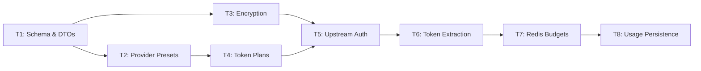

# Token-Based Usage Tracking — Sprint Roadmap (8 Sprints)

> **Reference**: [Implementation Plan](file:///C:/Users/Nisch/.gemini/antigravity/brain/87feb02f-37fc-437c-b251-e0cce868d0af/implementation_plan.md)
>
> This roadmap implements the token-based usage tracking system for APIGuard. Each sprint builds on the previous, progressing from schema foundations through gateway-level enforcement.

---

## Sprint T1: Schema & Shared DTOs

**Objective**: Lay the database and shared contract foundation across all modules.

**Tasks**:
*   Create Flyway migration `V7__add_token_tracking_and_upstream_auth.sql` in `api-management-service`:
    *   Add `provider_preset`, `upstream_api_key_encrypted`, `upstream_auth_type`, `upstream_auth_header_name`, `upstream_auth_header_value_template`, `upstream_extra_headers`, `total_tokens_path`, `input_tokens_path`, `output_tokens_path` to `registered_apis`.
    *   Add `usage_mode`, `weekly_token_limit`, `monthly_token_limit`, `session_token_limit`, `session_window_hours` to `plans`.
    *   Add `CHECK` constraints for `usage_mode` and `provider_preset`.
*   Create Flyway migration `V2__add_token_tracking.sql` in `usage-service`:
    *   Add `usage_mode`, `tokens_used`, `input_tokens`, `output_tokens` to `usage_logs`.
    *   Add `total_tokens` to `monthly_usage_summaries`.
    *   Create `weekly_token_summaries` table.
*   Update `ApiConfigDTO` in `common` — add `usageMode`, token limits, token extraction paths, and upstream auth fields.
*   Update `UsageEvent` in `common` — add `usageMode`, `tokensUsed`, `inputTokens`, `outputTokens`.

**Deliverable**: All migrations run cleanly. Existing data is untouched (all new columns have defaults). Shared DTOs compile across all modules.

---

## Sprint T2: Provider Presets & API Registration

**Objective**: Let API owners register APIs with a provider preset (OPENAI, ANTHROPIC, GEMINI, CUSTOM, NONE) that auto-fills auth and token extraction config.

**Tasks**:
*   Create `ProviderPreset` enum in `api-management-service/entity/` with preset configs for each provider (auth type, header name, header value template, extra headers, token paths).
*   Update `ApiRegistrationRequest` DTO — add `providerPreset`, `upstreamApiKey`, and optional custom fields.
*   Update `RegisteredApi` entity — add all new upstream and token path columns.
*   Update `ApiRegistrationService`:
    *   Resolve preset → auto-fill auth headers and token paths on the entity.
    *   For `CUSTOM` preset, use owner-provided values.
    *   Validate: if preset ≠ `NONE`, `upstreamApiKey` is required.
    *   Store upstream API key as **plaintext** temporarily (encryption comes in Sprint T3).
*   Update `ApiRegistrationController` to pass new fields through.

**Deliverable**: API owners can register an API with `"providerPreset": "OPENAI"` and the system auto-fills `Authorization: Bearer %s`, `usage.total_tokens`, etc. Verifiable via Postman.

---

## Sprint T3: Upstream API Key Encryption

**Objective**: Secure upstream API keys with AES-256-GCM encryption at rest.

**Tasks**:
*   Create `EncryptionService` in `api-management-service/service/`:
    *   `encrypt(String plaintext) → byte[]`
    *   `decrypt(byte[] ciphertext) → String`
    *   Encryption key loaded from env var `ENCRYPTION_SECRET_KEY`.
    *   Use AES-256-GCM (authenticated encryption with nonce).
*   Update `ApiRegistrationService` — encrypt the raw upstream API key before saving to `upstream_api_key_encrypted`.
*   Update `InternalConfigController.getApiConfig()`:
    *   Decrypt the upstream API key.
    *   Format it using the `headerValueTemplate` (e.g., `"Bearer %s"` → `"Bearer sk-abc123"`).
    *   Include it in `ApiConfigDTO.upstreamAuthHeaderValue`.
*   Ensure the raw upstream key is **never returned** in any public-facing API response.
*   Add `ENCRYPTION_SECRET_KEY` to `compose.yaml` and `application.yaml` env vars.
*   Write unit tests for `EncryptionService` (round-trip encrypt/decrypt, different key lengths, error handling).

**Deliverable**: Upstream API keys stored as encrypted `BYTEA` in PostgreSQL. Decrypted only when serving internal config to the gateway. `GET /api/v1/apis` never exposes the key.

---

## Sprint T4: Token-Based Plan Management

**Objective**: Allow API owners to create TOKEN-mode plans with session, weekly, and monthly token limits.

**Tasks**:
*   Update `Plan` entity — add `usageMode`, `weeklyTokenLimit`, `monthlyTokenLimit`, `sessionTokenLimit`, `sessionWindowHours` fields with defaults.
*   Update `PlanRequest` DTO — add the same fields.
*   Update `PlanResponse` DTO — include all token limit fields.
*   Update `PlanService.createPlan()`:
    *   If `usageMode` is null or empty, default to `"REQUEST"`.
    *   If `usageMode = TOKEN`:
        *   Validate the parent `RegisteredApi` has `providerPreset ≠ NONE`.
        *   Validate at least one token limit > 0.
        *   Default `sessionWindowHours` to 5 if not provided.
    *   Map all new fields in `createPlan()` and `mapToResponse()`.
*   Update `InternalConfigController.getApiConfig()` — include plan's token limits in `ApiConfigDTO`.
*   Write tests:
    *   Cannot create TOKEN plan on an API with preset `NONE`.
    *   Cannot create TOKEN plan with all limits = 0.
    *   REQUEST mode plans work exactly as before.

**Deliverable**: `POST /api/v1/apis/{apiId}/plans` accepts `{"name":"Pro","usageMode":"TOKEN","weeklyTokenLimit":100000,"monthlyTokenLimit":500000,"sessionTokenLimit":20000}`. Gateway receives these limits in the cached config.

---

## Sprint T5: Gateway — Upstream Auth Injection

**Objective**: The gateway injects the owner's upstream API key into proxied requests and strips the consumer's `X-Api-Key`.

**Tasks**:
*   Create `UpstreamAuthFilter` in `gateway-service/filter/` (GlobalFilter, order = 0):
    *   Skip if `upstreamAuthType = "NONE"` or config is null.
    *   For `"HEADER"` type:
        *   Remove consumer's `X-Api-Key` header.
        *   Add `upstreamAuthHeaderName: upstreamAuthHeaderValue` (e.g., `Authorization: Bearer sk-xxx`).
        *   Parse and add `upstreamExtraHeaders` JSON (e.g., `anthropic-version: 2023-06-01`).
    *   For `"QUERY_PARAM"` type (Gemini):
        *   Append `?key=<value>` to the request URI.
        *   Still remove `X-Api-Key` header.
*   Update `ApiConfigCacheService` — ensure the new `ApiConfigDTO` fields are properly cached/deserialized from Redis.
*   Update Redis serialization config if needed (new fields in cached DTO).
*   Test end-to-end:
    *   Register an API with `OPENAI` preset and a test upstream key.
    *   Send a request through the gateway.
    *   Verify the upstream receives `Authorization: Bearer <owner-key>` and NOT the consumer's `X-Api-Key`.

**Deliverable**: Credit reselling works — consumers use their APIGuard key, the gateway transparently authenticates to the upstream API with the owner's key.

---

## Sprint T6: Gateway — Token Extraction from Responses

**Objective**: Extract token counts from downstream API response bodies using the configured JSON paths.

**Tasks**:
*   Create `TokenExtractionService` in `gateway-service/service/`:
    *   `extractTokenCount(String body, String jsonPath) → long`: navigate JSON using dot-notation path (Jackson `JsonNode` traversal).
    *   `extractAllTokens(String body, ApiConfigDTO config) → TokenCounts`: extract total, input, output tokens. For Anthropic (no `totalTokensPath`), compute total = input + output.
    *   Handle nulls, missing paths, malformed JSON gracefully → return 0 (fail-open).
*   Modify `UsageLoggingFilter` for TOKEN mode:
    *   Wrap the response using `ServerHttpResponseDecorator` to capture the body via `DataBufferUtils.join()`.
    *   Cap buffer at 64KB (configurable via `app.token.max-buffer-bytes`).
    *   After capturing body, call `TokenExtractionService.extractAllTokens()`.
    *   Publish enriched `UsageEvent` with `tokensUsed`, `inputTokens`, `outputTokens`.
    *   For REQUEST mode, existing behavior is unchanged.
*   Write unit tests for `TokenExtractionService`:
    *   OpenAI response format: `{"usage":{"prompt_tokens":10,"completion_tokens":20,"total_tokens":30}}`
    *   Anthropic response format: `{"usage":{"input_tokens":15,"output_tokens":25}}`
    *   Gemini response format: `{"usageMetadata":{"promptTokenCount":10,"candidatesTokenCount":20,"totalTokenCount":30}}`
    *   Edge cases: missing fields, deeply nested paths, non-JSON responses, empty body.

**Deliverable**: Token counts are extracted from proxied responses and included in RabbitMQ usage events. Verifiable by checking RabbitMQ messages after proxied requests.

---

## Sprint T7: Gateway — Redis Token Budget Enforcement

**Objective**: Real-time token budget checking and enforcement at the gateway using Redis Lua scripts.

**Tasks**:
*   Create Lua script `token_budget_check.lua`:
    *   Atomically read session, weekly, and monthly token counters.
    *   For session: check if rolling window has expired (compare `windowStart + windowHours` vs current time). If expired, treat as 0.
    *   Return: `{sessionUsed, weeklyUsed, monthlyUsed, sessionExceeded, weeklyExceeded, monthlyExceeded}`.
*   Create Lua script `token_budget_increment.lua`:
    *   Atomically increment all three counters.
    *   Session: create `HASH {count, windowStart}` if not exists or expired. Set TTL = `sessionWindowHours`.
    *   Weekly: increment counter. Set TTL = seconds until next Sunday 00:00 UTC.
    *   Monthly: increment counter. Set TTL = seconds until 1st of next month 00:00 UTC.
*   Create `TokenBudgetService` in `gateway-service/service/`:
    *   `checkBudgets(apiKeyId, config) → Mono<BudgetResult>`: execute check Lua script.
    *   `incrementTokens(apiKeyId, tokenCounts, config) → Mono<Void>`: execute increment Lua script.
    *   `BudgetResult` record: remaining amounts per window, exceeded flag, reset timestamps.
*   Create `TokenBudgetFilter` in `gateway-service/filter/` (GlobalFilter, order = 1):
    *   Skip for REQUEST mode.
    *   Call `checkBudgets()` — if any budget exceeded, return 429 with descriptive message.
    *   Add `X-Token-Session-Remaining`, `X-Token-Weekly-Remaining`, `X-Token-Monthly-Remaining` response headers.
    *   Add `X-Token-*-Reset` headers with epoch-ms reset times.
*   Register both Lua scripts as `RedisScript` beans (similar to existing `rateLimitScript`).
*   Update `UsageLoggingFilter` — after token extraction (Sprint T6), call `TokenBudgetService.incrementTokens()` to update Redis counters.
*   Test:
    *   Session limit: send requests until session budget exceeded → verify 429.
    *   Weekly limit: artificially set counter near limit → verify 429.
    *   Monthly limit: same approach.
    *   Verify response headers show correct remaining amounts.
    *   Verify TTLs are calculated correctly (session=5h, weekly=to-Sunday, monthly=to-1st).

**Deliverable**: Token-mode API keys are blocked with 429 when any budget is exceeded. Response headers show remaining budgets. No key disabling — the key stays active and unblocks when the window resets.

---

## Sprint T8: Usage Service — Token Persistence & Weekly Reset

**Objective**: Persist token usage data in PostgreSQL and handle weekly/monthly resets for analytics and webhooks.

**Tasks**:
*   Update `UsageLog` entity — add `usageMode`, `tokensUsed`, `inputTokens`, `outputTokens`.
*   Update `MonthlyUsageSummary` entity — add `totalTokens`.
*   Create `WeeklyTokenSummary` entity + `WeeklyTokenSummaryRepository` with upsert:
    ```sql
    INSERT INTO weekly_token_summaries (api_key_id, year_week, total_tokens)
    VALUES (:apiKeyId, :yearWeek, :tokens)
    ON CONFLICT (api_key_id, year_week) DO UPDATE SET
        total_tokens = weekly_token_summaries.total_tokens + :tokens
    ```
*   Update `MonthlyUsageSummaryRepository.upsertUsage()` → new `upsertUsageWithTokens()` that also increments `total_tokens`.
*   Update `UsageService.processUsageEvent()`:
    *   Use enriched `UsageEvent` fields (`tokensUsed`, `inputTokens`, `outputTokens`).
    *   Call `upsertUsageWithTokens()` for all events.
    *   For TOKEN mode events with `tokensUsed > 0`, also upsert `WeeklyTokenSummary`.
*   Update `QuotaEnforcementServiceImpl.checkAndEnforceQuota()`:
    *   Accept `usageMode` parameter.
    *   For `REQUEST` mode: existing behavior (disable key when quota exceeded).
    *   For `TOKEN` mode: skip key disabling (gateway handles 429 via Redis). Still trigger webhook notifications at threshold percentages.
*   Create `WeeklyResetScheduler` in `usage-service/scheduler/`:
    *   Runs every Sunday at 00:00 UTC (`cron = "0 0 0 * * SUN"`).
    *   Primary purpose: trigger webhook notifications with weekly usage summaries.
    *   Redis counter TTLs handle the actual reset automatically.
*   Update existing `MonthlyResetScheduler`:
    *   For TOKEN-mode keys, no need to re-enable (they were never disabled).
    *   Only re-enable REQUEST-mode keys disabled due to `QUOTA_EXCEEDED`.
*   Test:
    *   Publish a `UsageEvent` with `usageMode=TOKEN` and `tokensUsed=150` → verify `weekly_token_summaries` and `monthly_usage_summaries.total_tokens` are updated.
    *   Verify TOKEN-mode keys are NOT disabled by quota enforcement.
    *   Verify REQUEST-mode behavior is unchanged.
    *   Verify `WeeklyResetScheduler` triggers correctly.

**Deliverable**: Complete end-to-end token tracking pipeline. Tokens are extracted at the gateway, enforced via Redis, persisted in PostgreSQL for analytics, and webhooks fire at configured thresholds. All existing request-based functionality remains intact.

---

## Sprint Dependency Graph



> **Note**: Sprints T2 and T3 can run in parallel since they touch different concerns (presets vs encryption). All other sprints are sequential.

---

## Post-Sprint Verification

After all 8 sprints are complete, run the full integration test:

1. **Register API**: `POST /api/v1/apis` with `providerPreset: "OPENAI"` and upstream key
2. **Create TOKEN plan**: `POST /api/v1/apis/{id}/plans` with `usageMode: "TOKEN"`, session/weekly/monthly limits
3. **Generate API key**: `POST /api/v1/keys/generate` linked to the TOKEN plan
4. **Send requests**: Use the consumer key to proxy requests through the gateway
5. **Verify token counting**: Check Redis counters and response headers for accurate token budgets
6. **Hit session limit**: Send requests until `X-Token-Session-Remaining: 0` → next request returns 429
7. **Wait for session reset**: After 5 hours (or TTL manipulation), requests succeed again
8. **Verify persistence**: Check `weekly_token_summaries` and `monthly_usage_summaries` in PostgreSQL
9. **Verify backward compat**: Existing REQUEST-mode plans continue to work unchanged
